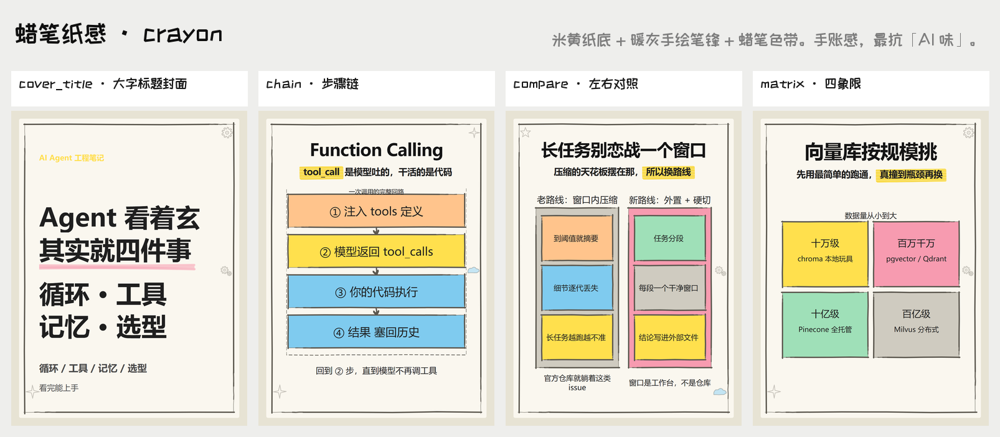
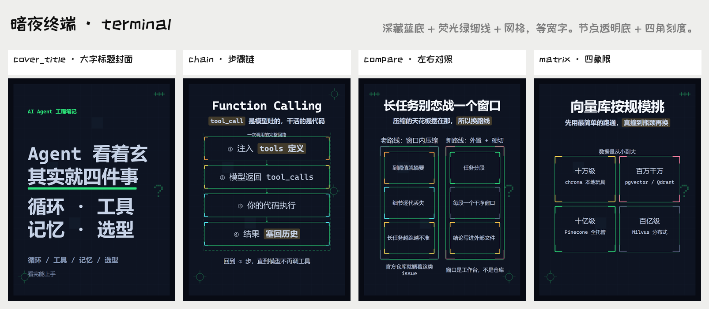
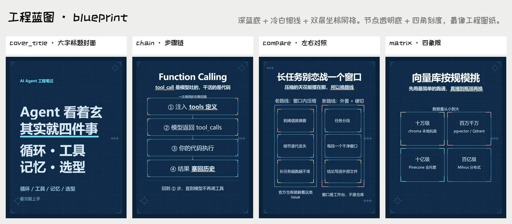
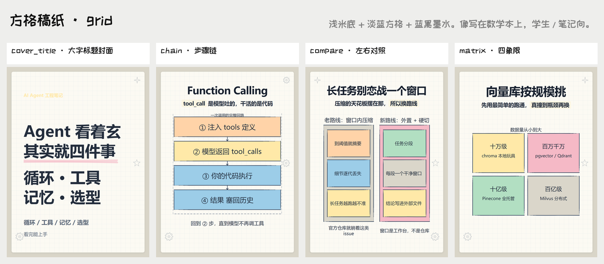
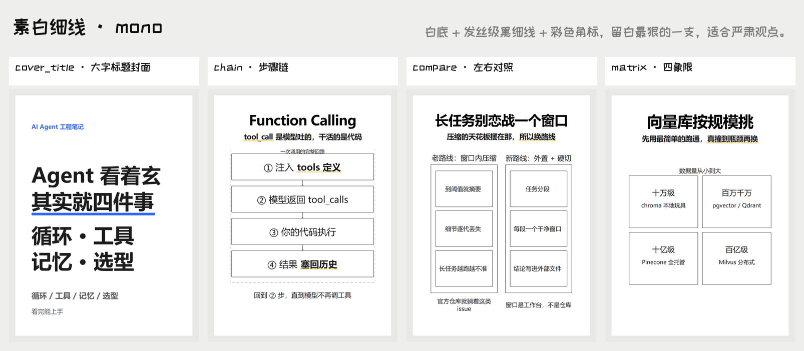
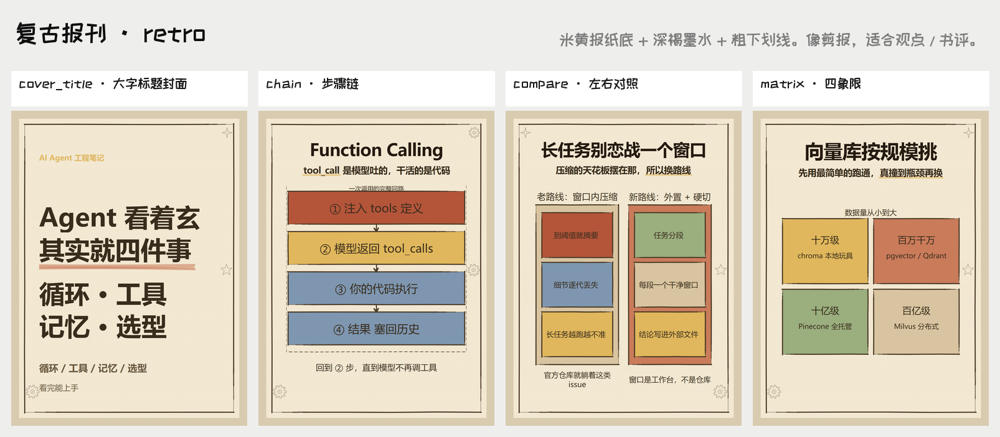
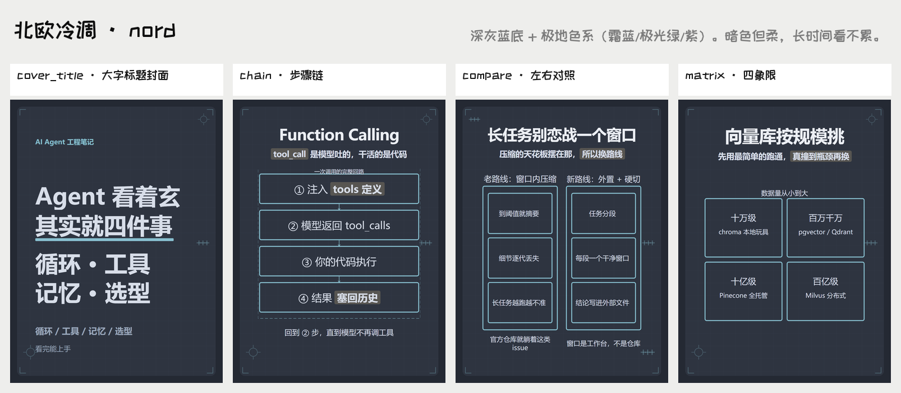
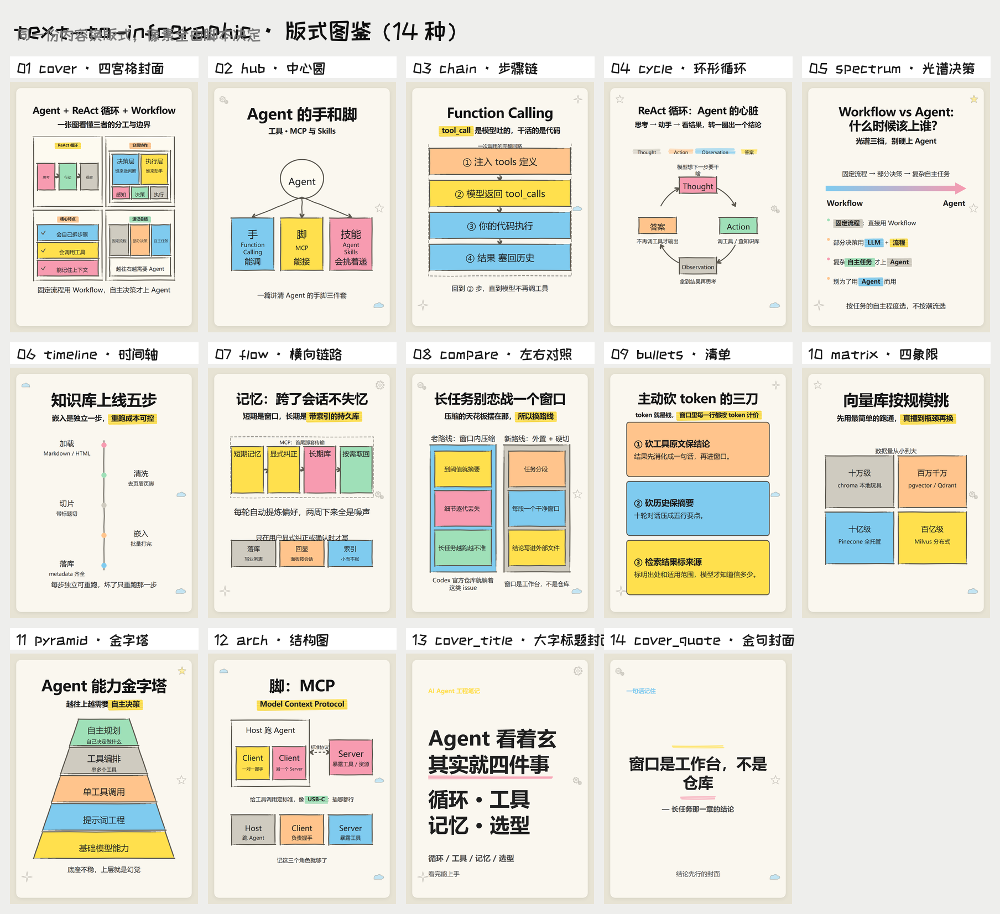
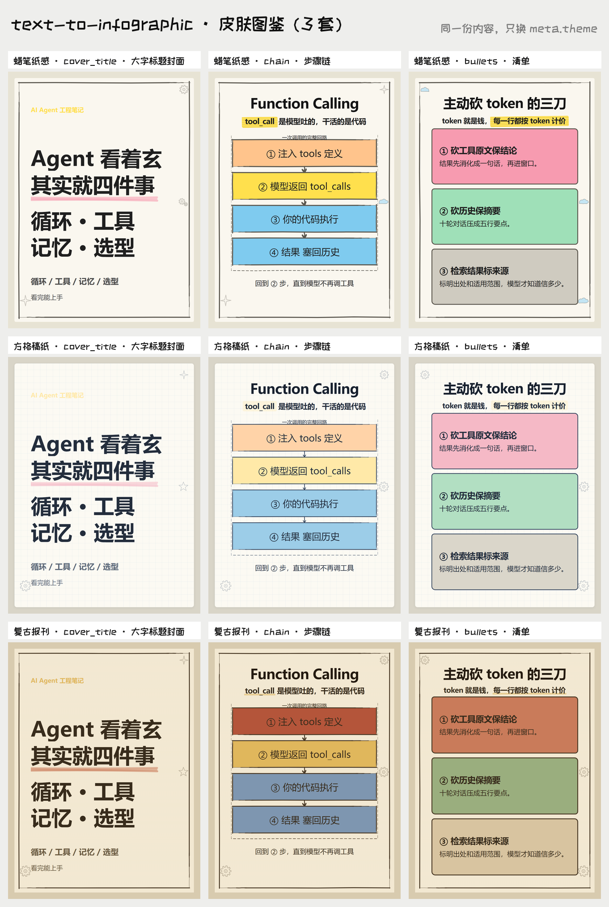

# text-to-infographic

> **Turn a long article into a ready-to-publish 3:4 card carousel** — a cover plus one page per key
> point, 7 skins to choose from. You hand it the article; the scripts own every pixel.

[中文说明](README.md) · [SKILL.md](SKILL.md) · [docs/](docs/)

Text is always crisp (never garbled the way image generation renders CJK), every page stays
hand-editable, and the same spec always renders the same set of images — byte for byte.
The model writes copy inside a declared character budget; fonts, spacing, strokes and colors are
decided by code:

```
article.md ──> run.py --plan ──> [LLM] spec.json ──> run.py (four gates + render) ──> PNG × N
```

---

## 🚀 Quick start

### 1 · Install: send this line to your agent

**Windows (PowerShell):**

```text
帮我安装 text-to-infographic：irm https://raw.githubusercontent.com/Chendestiny/text-to-infographic/main/install.ps1 | iex
```

**macOS / Linux / WSL:**

```text
帮我安装 text-to-infographic：curl -fsSL https://raw.githubusercontent.com/Chendestiny/text-to-infographic/main/install.sh | bash
```

**Behind the Great Firewall: use the Gitee mirror** (same content, kept in sync with GitHub)

```text
帮我安装 text-to-infographic：irm https://gitee.com/destinychen/text-to-infographic/raw/main/install.ps1 | iex
```

```text
帮我安装 text-to-infographic：curl -fsSL https://gitee.com/destinychen/text-to-infographic/raw/main/install.sh | bash
```

> **Pick either line** — the script probes GitHub first (3 s) and falls back to the Gitee mirror when
> it cannot reach it; if a clone fails it retries against the other mirror. Pin a repo explicitly with
> `-Repo <url>` (Windows) / `--repo <url>`, or the `T2I_REPO` environment variable.
>
> This is a skill, so let the agent drive both the install and the usage: the script clones into
> `~/.agents/skills/`, probes Python / Chrome / the bundled font, installs `pyyaml` if it is
> missing, and finally runs `doctor`. Inspect only, write nothing: `-CheckOnly` (Windows) /
> `--check-only` (macOS/Linux).

### 2 · Use: one more line to your agent

```text
Use text-to-infographic (~/.agents/skills/text-to-infographic)
Turn D:\notes\article.md into a Xiaohongshu carousel, save the images to my desktop
```

Everything else lives in [SKILL.md](SKILL.md), and the agent does it on its own:

| What the agent does automatically | Where it is mandated |
|---|---|
| Clones, probes the environment, runs `doctor`, fixes what is missing | install script |
| Five steps: read → write spec → **pass the spec gate** → run the pipeline → deliver | SKILL.md steps 1–5 |
| Gets the page count by **running `run.py --plan`**, not by deriving it | SKILL.md step 2 + `scripts/run.py --plan` |
| Gets slot sizes by **running `run.py --budget`** (wrapping and shrinking are the browser's job), not by memorising budgets | `scripts/run.py --budget` |
| All four gates must pass; `needs_llm` means shortening copy and re-running, never skipping | SKILL.md steps 4–5 |
| **Reviews the contact sheet** (720px thumbnails, 4 per sheet) for broken words, orphan lines, overlap, mismatched counts | `scripts/review_sheet.py` |
| Prints a per-card health table plus the specific problems (`dom-overflow` / `dom-orphan` / box or line crossings), naming each card | `scripts/pipeline.py` |
| Uses **rect intersection** for overlap checks instead of a vision model; vision is only a final aesthetic spot-check | `scripts/measure.py` |
| Reports the gate output **verbatim** + page-count reasoning + degradation report + self-check result | SKILL.md step 6 |

Output is `card-01.png …`, 2160×2880 by default (3:4 @2x; `render.py --scale 1` gives 1080×1440).

### 3 · Or drive it yourself (if you want to change the code)

```bash
git clone https://github.com/Chendestiny/text-to-infographic
cd text-to-infographic
python -c "import yaml" || pip install pyyaml                                    # hard requirement
python scripts/run.py examples/json/agent-roadmap.json --out out/demo           # four gates + render
python scripts/run.py examples/json/agent-roadmap.json --budget --no-render     # slot budgets only
python scripts/run.py examples/json/agent-roadmap.json --only 3 --out out/demo  # rework one page (1-2s)
python scripts/run.py examples/json/agent-roadmap.json --theme blueprint --out out/demo   # switch skin
python tests/run.py                                                             # self-test
```

- The only dependencies are Python 3.8+, `pyyaml` and any Chromium browser (auto-detected); the font
  is bundled. `pyyaml` is needed by the **spec gate**, which parses the contract itself
  (`templates/contracts.yaml`, YAML) — so writing `.json` specs does not remove it
- Copy a spec shape from [examples/](examples/) — running `examples/agent-roadmap.json` gives you a finished deck

---

## 🖼 What comes out

One deck of 8 pages, rendered under **7 skins**, 4 pages from each shown side by side — all produced
by scripts, not by a designer:















---

## 🧩 15 layouts · 7 skins

**These are two separate things**: the layout decides *what goes where*, the skin decides *what it
looks like*. Any of the 15 × 7 combinations works, and **not a single layout field changes**.



`cover` 2×2 summary cover · `cover_title` big-title cover · `cover_quote` quote cover ·
`hub` hub circle · `chain` step chain · `cycle` cycle · `spectrum` spectrum ·
`timeline` timeline · `flow` horizontal flow · `bullets` checklist · `compare` side-by-side ·
`matrix` 2×2 quadrants · `pyramid` tiers · `arch` architecture · `raw` raw inline SVG



| `meta.theme` | family | what it looks like |
|---|---|---|
| `crayon` | paper | cream paper + warm-grey hand-drawn strokes + crayon bands. **Default** |
| `grid` | paper | pale cream + light blue grid + blue-black ink |
| `retro` | paper | newsprint cream + dark brown ink + heavy underlines |
| `terminal` | diagram | dark navy + neon-green hairlines + grid, monospace |
| `blueprint` | diagram | dark blue + cold-white hairlines + a double coordinate grid |
| `mono` | diagram | white + black hairlines, the most restrained |
| `nord` | diagram | dark grey-blue + polar palette (frost blue / aurora green / purple) |

**The two families draw nodes differently**: paper skins distinguish nodes with *filled blocks*;
diagram skins use a *transparent fill + a theme-colored hairline + corner ticks*, never a saturated
fill. Fields, budgets and all four gates stay identical.
Details: [docs/layouts.md](docs/layouts.md) (layout fields) · [assets/style.md](assets/style.md) (skin tokens).

Pick a skin / tune the node drawing: `python make_theme_gallery.py --family paper` (writes to the
Desktop), `python make_style_probe.py` (columns = skins, rows = box styles).

---

## ✍️ Spec syntax

`[[keyword]]` adds a highlighter band (the color rotates per skin); `[[word|b]]` pins a color
(`b` blue / `y` yellow / `p` pink / `gr` green / `g` gray / `o` orange).
Boxes are filled by default — write `"fill": "none"` to leave one blank and say "this step is minor".

```yaml
meta: { theme: crayon, footer: "" }
cards:
  - layout: chain
    title: Function Calling
    subtitle: "[[tool_call]] 是模型吐的，干活的是代码"
    steps:
      - {text: "① 注入 [[tools 定义]]"}
      - {text: "③ 模型返回 tool_calls", fill: yellow}
    note: "回到 ② 步，直到模型不再调工具"
```

---

## 🛡 Page count and the four gates

**Run the script for the page count** instead of deriving it, and let *measurement* decide capacity
rather than memorised budgets:

```bash
python scripts/run.py --plan <article.md>   # characters/sections → suggested count + range + per-page skeleton
python scripts/run.py <spec> --budget       # per-slot size and starting font size (before writing copy)
```

| gate | what it catches |
|---|---|
| preflight | quantity words that disagree with the actual number of items |
| spec gate | unknown fields / out-of-range item counts / page count over the hard cap (over-budget copy is only a notice, with an exact path) |
| pixel gate | real-browser measurement: does not fit, drawn off-canvas, crossing a box or line, two runs of text overlapping |
| content gate | **silently swallowed text** — copy registered in the spec that never made it onto the card, or got truncated to "…" |

All four gates live inside one command and it ends with a verdict (page count lands in 4–9;
6–9 is the platform sweet spot):

```bash
python scripts/run.py <spec.json> --article <article.md> --out <dir>   # deliver
python scripts/run.py <spec.json> --only 3 --out <dir>                 # rework one page (1-2s)
```

---

## 📦 Runs out of the box

Python 3.8+ · `pyyaml` (the spec gate parses the contract itself, so `.json` specs do not remove it) ·
any Chromium browser (auto-detected). The font ships with the repo; no network and no multimodal
model are required (correctness is measured as plain text).

```bash
python scripts/doctor.py    # environment self-check
python tests/run.py         # self-test: 32 checks, about 80 seconds
```

Entry points and manuals: `SKILL.md` (agent playbook) · `scripts/run.py` (the only entry) ·
`scripts/ink.py` (render core) · `scripts/theme.py` (skin tokens) ·
`templates/contracts.yaml` (character contract) · `examples/` (5 complete specs) · `docs/` · `tests/`.
Read [CONTRIBUTING.md](CONTRIBUTING.md) before changing code; [CHANGELOG.md](CHANGELOG.md) says what changed.

---

## 📄 License

Code is MIT. The bundled font (ZCOOL KuaiLe) is under
[SIL OFL 1.1](assets/fonts/OFL.txt); the boundary between the two is in [LICENSE](LICENSE) — it is
also the only third-party asset in the repo. Usage boundaries: [SECURITY.md](SECURITY.md).
