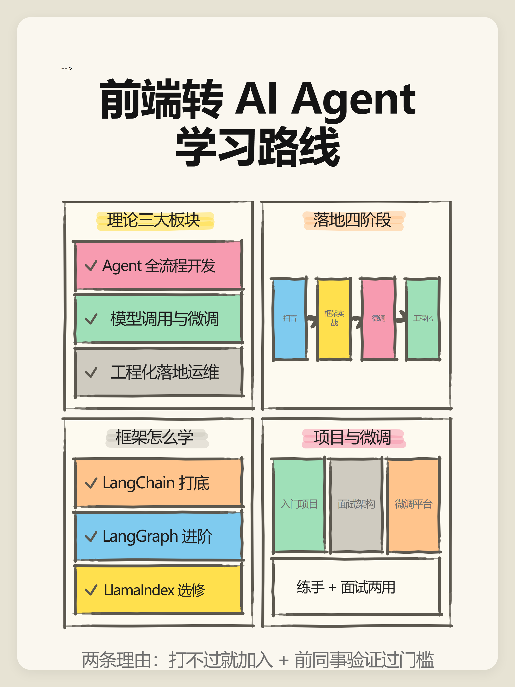

# text-to-infographic

**Turn any article into ready-to-publish Xiaohongshu / Instagram style information cards —
a cover plus one page per key point, 3:4 vertical, hand-drawn card style.**

[中文说明](README.zh-CN.md)

Text always comes out crisp (never garbled the way AI image generation renders it), every page
can be hand-edited, and the layout is done end to end by the tool — you just hand it an article.



## Why not just ask the model to draw it?

AI image generation garbles text — especially CJK. And letting an LLM free-style HTML "infographics"
produces something different every run: inconsistent spacing, overflowing text, one-off layouts.

This skill moves the LLM to where it is strong (reading, structuring, summarizing) and moves pixels
to a deterministic renderer:

```
article.md ──> [LLM] cards.json ──> build.py ──> measure (real browser) ──> PNG × N
                 only this step       all pixel decisions          verify loop
                 needs the LLM        live in the scripts          (LangGraph-style)
```

## Quick start

```bash
git clone https://github.com/Chendestiny/text-to-infographic
cd text-to-infographic
python scripts/doctor.py            # environment self-check
                                    #   Windows: use `py -3` if `python` isn't on PATH
python scripts/pipeline.py examples/agent-roadmap.json -o out/
```

- Spec files can be **.json (zero third-party dependencies)** or .yaml (needs `pip install pyyaml`)
- Rendering needs any Chromium-based browser (Chrome / Edge / Chromium) — auto-detected
- Font (ZCOOL KuaiLe, OFL license) is bundled — nothing to install

Full workflow for agent users is in [SKILL.md](SKILL.md);
detailed manuals (layouts, contracts, rendering, troubleshooting) are in [docs/](docs/).

## The contract system (the core idea)

Every layout declares a **character budget for every text slot** in
[templates/contracts.yaml](templates/contracts.yaml) — measured from renders that actually look good,
not guessed.

1. The LLM reads your article and fills the spec **within the contract**
2. `validate.py` mechanically checks every slot *before* rendering, and reports exact paths:
   `card-03(chain).steps[1].text: 17.5 > max 15`
3. `measure.py` renders in a real browser, grabs **actual text bounding boxes** via `getBBox()`,
   and compares them against the box manifest baked into the HTML
4. If anything still overflows, the pipeline calibrates its own width estimator, injects
   `textLength` where needed, and re-runs — up to 3 rounds
5. Copy that still doesn't fit is escalated as a `needs_llm` list — that's where the LLM steps back in,
   with a precise error instead of "it looks broken"

Two gates, both deterministic: the spec gate is cheap and catches most issues; the pixel gate is
expensive and catches the rest. The pixel gate also carries a **content gate** -- every string
the spec registered must actually show up in the rendered card, which is how text that is
neither overflowing nor clipped but simply never drawn gets caught. The LLM is never asked to
"make it look right".

## Layouts (13)

| layout | shape | use for |
|---|---|---|
| `cover` | **summary cover**: title + 2×2 grid, each quadrant a mini layout | first page |
| `hub` | title + hub circle + concept boxes | any page about parallel concepts |
| `chain` | vertical boxes + arrows | steps, loops |
| `cycle` | nodes on a circle, curved arrows | ReAct / PDCA |
| `spectrum` | gradient arrow + end labels + list | "when to use A vs B" |
| `timeline` | centered vertical axis, alternating labels | stages, evolution |
| `flow` | horizontal nodes (+ bottom strip) | pipelines, data flow |
| `bullets` | bullet rows that stretch to fill | pitfalls, lists |
| `compare` | two columns, inner blocks auto-fit | do / don't |
| `matrix` | 2×2 quadrants | choose by scale/dimension |
| `pyramid` | stacked trapezoid tiers | capability levels, priorities |
| `arch` | nested boxes + arrow + chip row | roles, architecture |
| `raw` | inline SVG escape hatch | anything else |

12 rendered layout samples (raw has no sample): [docs/images/layouts/](docs/images/layouts/)

Decorations (gears, stars — all drawn as SVG paths, no bitmaps) are part of the kit and rotate
automatically:


## Copy syntax

`[[keyword]]` gives the text a marker-pen highlight (rotating colors — blue, yellow, pink,
green, gray, orange); `[[keyword|b]]` pins a specific color. Boxes take `fill` too.

```yaml
- layout: chain
  title: Function Calling
  subtitle: "[[tool_call]] is emitted by the model — your code does the work"
  steps:
    - {text: "① inject [[tools definition]]"}
    - {text: "③ model returns tool_calls", fill: yellow}
  note: "loop back to ② until the model stops calling tools"
```

## Dependencies

| dependency | required? | notes |
|---|---|---|
| Python 3.8+ | yes | stdlib only for the core scripts |
| pyyaml | optional | only for .yaml specs; **.json specs = zero third-party deps** |
| Chromium browser | for rendering | Chrome / Edge / Chromium, auto-detected |
| multimodal model | optional | correctness checks are pure text metrics; vision only adds an aesthetic final pass |

## Repository layout

```
SKILL.md                  agent-facing entry point (workflow + contract + discipline)
scripts/ink.py            rendering core: hand-drawn primitives + 13 layouts + page assembly
scripts/decor.py          decoration parts (gears / stars, pure SVG)
scripts/build.py          CLI: spec → HTML
scripts/validate.py       CLI: character-contract check (spec gate)
scripts/render.py         CLI: HTML → PNG (cross-platform browser detection)
scripts/measure.py        real-browser text measurement (pixel gate)
scripts/pipeline.py       LangGraph-style orchestration: build → measure → fix loop → render
scripts/doctor.py         environment self-check
templates/contracts.yaml  per-layout character budgets (the contract)
examples/                 5 full specs (yaml + json)
docs/images/              rendered samples used by this README
```

## License

MIT for the code. The bundled font (ZCOOL KuaiLe) is under the
[SIL Open Font License 1.1](assets/fonts/OFL.txt) — see LICENSE for the split.
