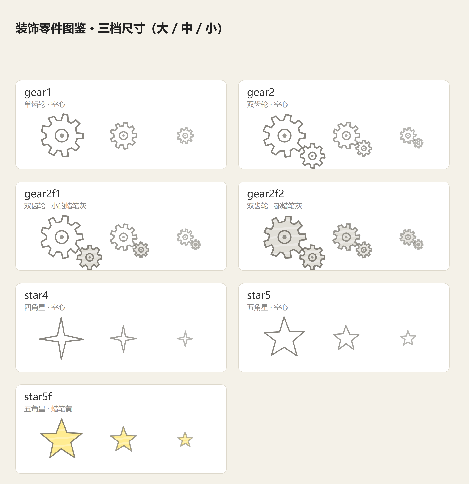

# text-to-infographic

> **Turn a long article into a ready-to-publish 3:4 card carousel** — a cover plus one page per key
> point, hand-drawn card style. You hand it the article; the scripts own every pixel.

[中文说明](README.zh-CN.md) · [SKILL.md](SKILL.md) · [docs/](docs/)

Text is always crisp (never garbled the way image generation renders CJK), every page stays
hand-editable, and the same spec always renders the same set of images — byte for byte.

---

## 🖼 What comes out

A real run: 《一张架构图说清楚 Agent + ReAct 循环 + Workflow》 → **9 cards**, 2160×2880 (3:4 @2x).
Six of them, two per row:

|  |  |
|---|---|
|||
|||
|||

The first card is a **summary cover**: a 2×2 grid where each quadrant is a miniature layout — the
table of contents, drawn. Every card after it carries one idea. Publish them in `card-01 … card-09`
order and the carousel is done; nothing needs retouching.

---

## 🚫 Why not just let the model draw it?

Image generation garbles text, CJK worst of all. And letting an LLM free-style HTML "infographics"
gives you something different every run: inconsistent spacing, overflowing text, one-off layouts.

So the LLM is moved to where it is strong (reading, structuring, compressing) and the pixels go to a
deterministic renderer:

```
article.md ──> [LLM] spec.json ──> validate ──> build ──> measure (real browser) ──> PNG × N
                the only step      spec gate   HTML      pixel gate + fix loop
                needing the LLM
```

The LLM never touches a font size, a margin, or a stroke. It writes copy that fits a declared budget,
and scripts decide everything else — that is why a run is reproducible and a page is editable.

---

## 🚀 Quick start

```bash
git clone https://github.com/Chendestiny/text-to-infographic
cd text-to-infographic

python scripts/doctor.py                                         # environment self-check
python scripts/pipeline.py examples/agent-roadmap.json -o out/   # full run -> out/card-*.png
```

- Windows: use `py -3` if `python` is not on PATH
- Specs are **.json (zero third-party deps)** or .yaml (`pip install pyyaml`)
- Rendering needs any Chromium browser (Chrome / Edge / Chromium) — auto-detected
- The font is bundled — nothing else to install

Then point your agent at [SKILL.md](SKILL.md); manuals live in [docs/](docs/).

---

## 🧭 How it stays correct: two gates, three checks

Every layout declares a **character budget for every text slot** in
[templates/contracts.yaml](templates/contracts.yaml), measured from renders that actually look good —
not guessed. Copy is written *inside* that budget instead of hoping it fits.

| gate | what it is | catches |
|---|---|---|
| **spec gate** `validate.py` | pure string math, milliseconds, zero tokens | copy over budget, reported by exact path: `card-03(chain).steps[1].text  17.5 > max 15` |
| **pixel gate** `measure.py` | renders in a real browser and reads **actual text bounding boxes** via `getBBox()` | real width overflow, text past the canvas, text spilling out of its box, HTML rows breaking the card bottom |
| **content gate** (inside the pixel gate) | every string the spec registered must actually appear in the render | text that is neither overflowing nor clipped but simply **never drawn** |

Misfit copy is escalated as a `needs_llm` list, so the model gets a precise error instead of "it looks
broken". The pipeline calibrates its own width estimator and re-runs — up to three rounds — before
asking for help. Full detail: [docs/contracts.md](docs/contracts.md) · [docs/architecture.md](docs/architecture.md).

---

## 🧩 Layouts (13)

| layout | shape | use for |
|---|---|---|
| `cover` | **summary cover**: title + 2×2 grid of mini layouts | first page |
| `hub` | title + hub circle + concept boxes | parallel concepts |
| `chain` | vertical boxes + arrows | steps, loops |
| `cycle` | nodes on a circle, curved arrows | ReAct / PDCA |
| `spectrum` | gradient arrow + end labels + list | "A or B?" trade-offs |
| `timeline` | centered vertical axis, alternating labels | stages, evolution |
| `flow` | horizontal nodes (+ bottom strip) | pipelines, data flow |
| `bullets` | bullet rows that stretch to fill | pitfalls, checklists |
| `compare` | two columns, inner blocks auto-fit | do / don't |
| `matrix` | 2×2 quadrants | pick by scale or dimension |
| `pyramid` | stacked trapezoid tiers | capability levels, priorities |
| `arch` | nested boxes + arrow + chip row | roles, architecture |
| `raw` | inline SVG escape hatch | anything the above cannot express |

<details>
<summary><b>All 12 rendered layout samples</b> (raw has none — click to expand)</summary>

|  |  |
|---|---|
|||
|||
|||
|||
|||
|||

</details>

Decorations (gears, stars — SVG paths, no bitmaps) rotate on their own, and a summary cover skips them
so they never sit on top of a quadrant:



---

## ✍️ Spec syntax

`[[keyword]]` paints a marker-pen highlight behind the text (colors rotate: blue → yellow → pink →
green → gray → orange); `[[keyword|b]]` pins a color. Boxes take `fill` the same way, and boxes are
filled by default — write `fill: none` to leave one blank on purpose.

```yaml
- layout: chain
  title: Function Calling
  subtitle: "[[tool_call]] is emitted by the model — your code does the work"
  steps:
    - {text: "① inject the [[tools definition]]"}
    - {text: "③ the model returns tool_calls", fill: yellow}
  note: "loop back to ② until the model stops calling tools"
```

---

## 📦 Requirements

| dependency | required? | notes |
|---|---|---|
| Python 3.8+ | yes | core scripts are stdlib-only |
| pyyaml | optional | only for .yaml specs; **.json specs need zero third-party packages** |
| Chromium browser | to render | Chrome / Edge / Chromium, auto-detected (CDP or CLI backend) |
| multimodal model | optional | correctness is pure text measurement; vision only adds an aesthetic last pass |

## 📁 Repository layout

```
SKILL.md                  agent-facing entry point (workflow, contract, copy discipline)
scripts/ink.py            rendering core: hand-drawn primitives + 13 layouts + page assembly
scripts/decor.py          decoration parts (gears / stars, pure SVG)
scripts/build.py          CLI: spec → HTML
scripts/validate.py       CLI: character-contract check (spec gate)
scripts/render.py         CLI: HTML → PNG (browser detection)
scripts/measure.py        real-browser text measurement (pixel + content gates)
scripts/pipeline.py       build → measure → fix loop → render, up to 3 rounds
scripts/doctor.py         environment self-check
scripts/vision_probe.py   one-shot check of whether the current model can really read images
templates/contracts.yaml  per-layout character budgets (the contract)
examples/                 5 complete specs (both .json and .yaml)
docs/                     manuals: layouts, contracts, rendering, troubleshooting, extending
docs/images/showcase/     the real run shown at the top of this README
```

---

## 🙏 Credits

- The carousel shown above is rendered from the author's own article
  《一张架构图说清楚 Agent + ReAct 循环 + Workflow》 — the subject is irrelevant to the tool,
  it is just a convenient long-form test case.
- Bundled font: **ZCOOL KuaiLe / 站酷快乐体**, the only third-party asset in the repo.

## 📄 License

MIT for the code. The bundled font is under the
[SIL Open Font License 1.1](assets/fonts/OFL.txt) — see [LICENSE](LICENSE) for the split.